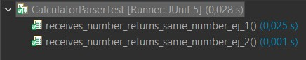
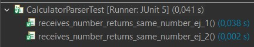
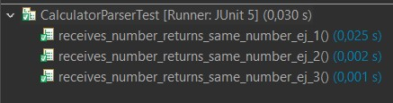
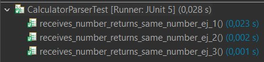
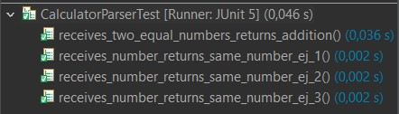
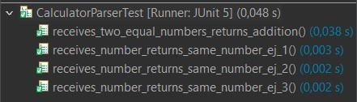

# Práctica 3 - Desarrollo guiado por pruebas

Nombre de los alumnos: Sergio Reguero Elez y Fernando Silvestre Menéndez

### Ejemplo 1

**INPUT y OUTPUT**: "1" -> 1

**EJ1. Código de test**
```java
@Test
    public void receives_number_returns_same_number_ej_1(){
		assertEquals(calculatorParser.parser("1"),1);
	}
```

**EJ1. Mensaje del test añadido que NO PASA**

```log
java.lang.Error: Unresolved compilation problem: 
	The method parser(String) is undefined for the type CalculatorParser
```

**EJ1. Código mínimo para que el test pase**

Recibe un String y devuelve un entero con valor 1, para asi pasar la prueba.

```java
public int parser(String string) { 
	int res = 1;
	return res;
}
```

**EJ1. Captura de que TODOS los test PASAN**


**EJ1. Refactorización**

Elimino la variable innecesaria.

```java
public int parser(String string) { 
	return 1;
}
```
**EJ1. Captura de que TODOS los tests PASAN tras la refactorización**


### Ejemplo 2

**INPUT y OUTPUT**: "2" -> 2

**EJ2. Código de test**
```java
@Test
    public void receives_number_returns_same_number_ej_2(){
		assertEquals(calculatorParser.parser("2"),2);
	}
```

**EJ2. Mensaje del test añadido que NO PASA**

```log
org.opentest4j.AssertionFailedError: expected: <2> but was: <1>

```

**EJ2. Código mínimo para que el test pase**

Se añade un if else, para los casos "1" y "2".

```java
public int parser(String string) {
	int res;
	if(string == "1") res = 1;
	else res = 2;
	return res;
}
```

**EJ2. Captura de que TODOS los test PASAN**



**EJ2. Refactorización**

Elimino la variable innecesaria y meto el return dentro del condicional.

```java
public int parser(String string) {
		if(string == "1") return 1;
		else return 2;
}
```
**EJ2. Captura de que TODOS los tests PASAN tras la refactorización**




### Ejemplo 3

**INPUT y OUTPUT**: "3" -> 3

**EJ3. Código de test**
```java
@Test
    public void receives_number_returns_same_number_ej_3(){
		assertEquals(calculatorParser.parser("3"),3);
}
```

**EJ3. Mensaje del test añadido que NO PASA**

```log
org.opentest4j.AssertionFailedError: expected: <3> but was: <2>

```

**EJ3. Código mínimo para que el test pase**

Se añade un if else extra para inlcuir el caso de "3".

```java
public int parser(String string) {
		if(string == "1") return 1;
		else if(string == "2") return 2;
		else return 3;
}
```

**EJ3. Captura de que TODOS los test PASAN**



**EJ3. Refactorización**

Se cambian los condicionales por el metodo parseInt().

```java
public int parser(String string) {
		return Integer.parseInt(string);
}
```
**EJ3. Captura de que TODOS los tests PASAN tras la refactorización**




### Ejemplo 4

**INPUT y OUTPUT**: "1 + 1" -> 2

**EJ4. Código de test**
```java
@Test
	public void receives_two_equal_numbers_returns_addition(){
		assertEquals(2,calculatorParser.parser("1 + 1"));
}
```

**EJ4. Mensaje del test añadido que NO PASA**

```log
java.lang.NumberFormatException: For input string: "1 + 1"

```

**EJ4. Código mínimo para que el test pase**

Si la longitud es mayo a 1, devolver 2.

```java
public int parser(String string) {
		if(string.length()>1) return 2;
		return Integer.parseInt(string);
}
```

**EJ4. Captura de que TODOS los test PASAN**



**EJ4. Refactorización**

Compruebo que la cadena es la esperada.

```java
public int parser(String string) {
		if(string.equals("1 + 1")) return 2;
		return Integer.parseInt(string);
}
```
**EJ4. Captura de que TODOS los tests PASAN tras la refactorización**

